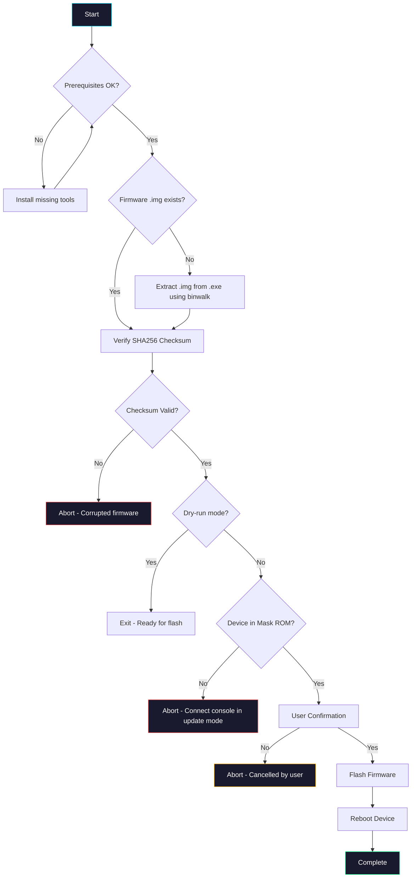

# Atari 7800+ Linux Firmware Upgrader

A safe, fully-automated firmware upgrade tool for the Atari 7800+ console on Linux. Extracts firmware from the official Windows updater `.exe`, verifies integrity, and flashes your console using `rkdeveloptool`.

## Features

- **Automatic extraction** — Uses `binwalk` to extract firmware from Windows `.exe`
- **Smart detection** — Auto-selects the correct `.img` file from extracted contents
- **Checksum verification** — SHA256 validation prevents corrupted flashes
- **Safe workflow** — Mask ROM detection and user confirmation before flashing
- **Dry-run mode** — Test extraction and verification without touching your console

## How It Works



## Requirements

| Tool | Install Command | Purpose |
|------|-----------------|---------|
| `rkdeveloptool` | `sudo apt install rkdeveloptool` | Flash Rockchip-based devices |
| `binwalk` | `sudo apt install binwalk` | Extract firmware from `.exe` |
| `sha256sum` | (pre-installed) | Verify firmware integrity |

**Also needed:**
- Official Atari 7800+ firmware updater `.exe` (download from [Atari](https://atari.com/blogs/newsroom/updating-atari-firmware))
- USB cable to connect Atari 7800+ in Mask ROM mode

## Installation

```bash
git clone https://github.com/masseo1/atari7800_plus_linux_upgrader.git
cd atari7800_plus_linux_upgrader
chmod +x flash_atari7800.sh
```

## Usage

### Standard Flash

1. Download the official firmware `.exe` and place it in this folder
2. Put your Atari 7800+ into **Mask ROM mode** (hold reset while connecting USB)
3. Run the script:

```bash
sudo ./flash_atari7800.sh
```

### Dry-Run Mode

Extract and verify firmware without flashing:

```bash
DRY_RUN=1 ./flash_atari7800.sh
```

### Custom Firmware File

```bash
FIRMWARE_EXE=MyFirmware.exe sudo ./flash_atari7800.sh
```

### Help

```bash
./flash_atari7800.sh --help
```

## Environment Variables

| Variable | Default | Description |
|----------|---------|-------------|
| `FIRMWARE_EXE` | `Atari7800_Firmware_Updater_2.0.1.4.1.exe` | Input firmware updater |
| `FIRMWARE_IMG` | `Atari_Firmware.img` | Extracted image filename |
| `OFFICIAL_SHA256` | (placeholder) | Expected SHA256 checksum |
| `DRY_RUN` | `0` | Set to `1` to skip flashing |

## Entering Mask ROM Mode

1. Disconnect power from your Atari 7800+
2. Hold the **Reset** button
3. Connect USB cable to your computer
4. Release Reset after 2-3 seconds
5. Verify detection: `rkdeveloptool ld` should show "Maskrom"

## Troubleshooting

| Issue | Solution |
|-------|----------|
| "No device detected" | Ensure console is in Mask ROM mode and USB is connected |
| "rkdeveloptool not found" | Install with `sudo apt install rkdeveloptool` |
| "binwalk extraction failed" | Ensure `.exe` is not corrupted; try re-downloading |
| "SHA256 mismatch" | Firmware may be corrupted; re-download the `.exe` |

## Warning

> **Flashing firmware carries inherent risk.**  THIS TOOL IS JUST FOR EXPERIMENTATION, It can break your device easily. I am not responsible for bricked devices.

## Contributing

Contributions welcome! Ideas:
- Support for additional firmware versions
- Automatic checksum lookup
- GUI frontend

## License

MIT License — free to use, modify, and share. Flash at your own risk.

---

*This is an unofficial community tool. Not affiliated with Atari.*
